<div align="center">
  
</div>

<div align="center">
  <a href="https://github.com/levinfritz?tab=repositories"></a>
  <a href="https://www.linkedin.com/in/levin-fritz/"></a>
  <a href="mailto:levin.fritz100@gmail.com"></a>
  <a href="https://www.instagram.com/Stiefel08/"></a>
</div>

<br />

```
Platform developer apprentice at Informatikdienste, City of St. Gallen.
Indie app maker shipping under Fritz Tech, handle Stiefel.
Building the boring infrastructure well, so my own things can launch.
```

---

## 🛰️ Ground Control

By day I keep the client fleet of a city IT department sane: packaging, deployment,
identity, and lately canvas apps on the Power Platform. Off the clock I build small,
focused apps alone and ship them. Two are live.

<table>
  <tr><td><b>Role</b></td><td>Informatiker EFZ, Plattformentwicklung</td></tr>
  <tr><td><b>Crew</b></td><td>Informatikdienste, Stadt St. Gallen</td></tr>
  <tr><td><b>Lehrabschluss</b></td><td>Summer 2027</td></tr>
  <tr><td><b>Callsign</b></td><td>Stiefel</td></tr>
  <tr><td><b>Company</b></td><td>Fritz Tech, sole proprietorship</td></tr>
  <tr><td><b>Base</b></td><td>Wittenbach, Canton St. Gallen</td></tr>
  <tr><td><b>Ask me about</b></td><td>PSADT packaging, Intune &amp; Entra ID, Power Apps, SwiftUI &amp; Flutter, shipping indie apps</td></tr>
</table>

---

## 🚀 Payloads

<table>
<tr>
<td width="50%" valign="top">

### 🍳 Pann
`Live on the App Store`

AI cooking assistant for iOS. Cook with what you already have, without counting
anything. Written, designed, released and marketed solo.

`SwiftUI` `Supabase` `AI`

[pann-app.com](https://www.pann-app.com)

</td>
<td width="50%" valign="top">

### 🔧 Fixable
`Live on iOS, Android and the web`

AI repair guide. Photograph a broken thing, get a step by step fix with the
tools you need, instead of replacing it.

`Flutter` `Node` `Supabase`

[fixable-app.com](https://www.fixable-app.com)

</td>
</tr>
</table>

---

## 🎛️ Onboard Systems

**Platform & Modern Workplace**

<p>
  
  
  
  
  
  
  
  
</p>

**Languages**

<p>
  
  
  
  
  
</p>

**Frameworks & Platforms**

<p>
  
  
  
  
  
  
</p>

**Tools & Services**

<p>
  
  
  
  
  
  
  
</p>

---

## ⬛ Black Box

Lessons recovered from things that went wrong.

- A hard paywall before the user has seen any value does not convert. It just makes them leave.
- An API key inside an app bundle is a public key. A scraper found mine in three days.
- Distribution is the moat. Technically weaker competitors beat me on marketing, never on code.
- Design is not decoration. When anyone can generate the code, the interface is what is left.

---

## 🧭 Current Trajectory

```text
[ ######################-- ]  Pann: product is built, everything goes into distribution
[ ##################------ ]  Fixable 3.x: shipped, now also flying in the browser
[ ############------------ ]  Power Platform at work: canvas apps for the city
[ ######------------------ ]  Next orbit: Azure, Kubernetes, CI/CD
```

---

<div align="center">
  <sub>🚀 Ad astra.</sub>
</div>
